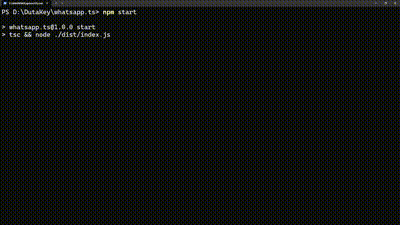
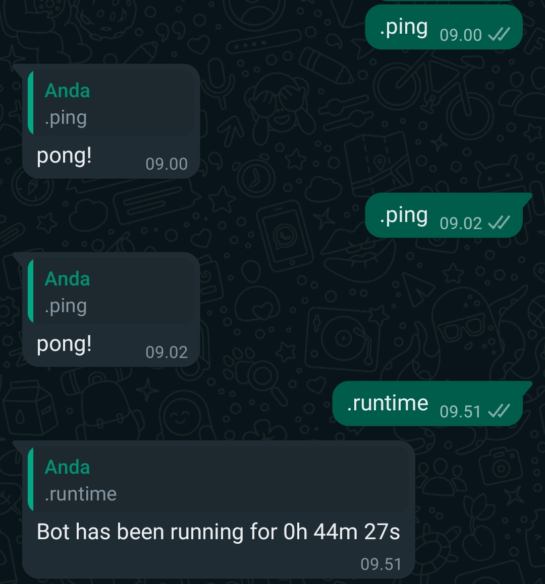

<p align="center">
  <a href="" rel="noopener">
 </a>
</p>

<div align="center">

[![Contributors][contributors-shield]][contributors-url]
[![Forks][forks-shield]][forks-url]
[![Stargazers][stars-shield]][stars-url]
[![Issues][issues-shield]][issues-url]
[![GPL3 License][license-shield]][license-url]

</div>

---

<p align="center"> 🤖 Receive and Reply to Your Messages Quickly 🚀
    <br> 
</p>

## 📝 Table of Contents

- [About](#about)
- [Demo / Working](#demo)
- [How it works](#working)
- [Getting Started](#getting_started)
- [Usage](#usage)
- [Add Command/Feature](#add_command)
- [Authors](#authors)
- [Acknowledgments](#acknowledgement)

## 🧐 About <a name = "about"></a>

<p>
  Whatsapp.ts is a Whatsapp Handler that uses Typescript that you can develop according to your needs.
</p>
<p>
  We provide code that is friendly to understand so that it is easy to develop in the future.
</p>

## 🎥 Demo / Working <a name = "demo"></a>



## 💭 How it works <a name = "working"></a>

Whatsapp.ts uses Baileys as its Whastapp Library.

Whatsapp.ts provides a Users management feature that is integrated with MongoDB which can make it easier for you to manage your users.

Whatsapp.ts is written using Typescript.

## 🏁 Getting Started <a name = "getting_started"></a>

These instructions will get you a copy of the project up and running on your local machine for development and testing purposes. See [deployment](#deployment) for notes on how to deploy the project on a live system.

### Prerequisites

- [NodeJS](https://nodejs.org/en/download)
- [Mongo Uri](https://www.mongodb.com/cloud/atlas)

### Installing

First, you must clone and install the necessary dependencies for this project

```
git clone https://github.com/DutaKey/whatsapp.ts
cd whatsapp.ts
npm install
```

Rename `.env.example` to `.env` or create new file called `.env`.<br />
And, Input Your `MONGO_URI`<br />

Next you can run Build to Build the Application

```
npm run build
```

After that you can run the application by doing so:

```
npm run start
```

you can also run this if you want to directly build and run the app

```
npm run start:build
```

And scan the QR that appears using the Whatsapp that you want to make into a Bot ✨

## 🎈 Usage <a name = "usage"></a>

We provide 4 built-in features for you to be an example and a guide for you to create features for the future.

### features we provide are

`ping` to ping your bot

`.help` to see list feature on your bot

`.runtime` to see how long your bot live

and

`.get` to get html on website

### Example:

Send bot command from another whatsapp number to your bot number message.

</a>

## ⛏️ Add Commands/Feature <a name = "add_command"></a>

Create a new file in `src/commands/{category}/`

#### Example On : `src/commands/general/game.ts`

then fill the file with type:

```ts
declare type Commands = {
	name: string;
	alias: string[];
	category: string;
	description: string;
	prefix: boolean;
	run: () => unknown;
};
```

#### Example

```ts
import type { Commands } from "../../types/command";
import axios from "axios";

export default <Commands>{
	name: "get",
	alias: [],
	category: "fetch",
	description: "Get Web Using Axios",
	prefix: true,
	async run({ msg, sock, client }) {
		const { body } = msg;
		const url = body.split(" ")[1] || false;
		if (!url) msg.reply("Please Provide Url");
		axios
			.get(url)
			.then((res) => {
				const responseData = res.data;
				msg.reply(responseData.toString());
			})
			.catch((err) => {
				msg.reply(err.toString());
			});
	},
};
```

Save and Try The Feature👍✨

## ✍️ Authors <a name = "authors"></a>

- [@DutaKey](https://github.com/DutaKey) - Idea & Initial work

See also the list of [contributors](https://github.com/DutaKey/whatsapp.ts/contributors) who participated in this project.

## 🎉 Acknowledgements <a name = "acknowledgement"></a>

- Hat tip to anyone whose code was used
- Inspiration
- References

[contributors-shield]: https://img.shields.io/github/contributors/DutaKey/whatsapp.ts.svg?style=for-the-badge
[contributors-url]: https://github.com/DutaKey/whatsapp.ts/graphs/contributors
[forks-shield]: https://img.shields.io/github/forks/DutaKey/whatsapp.ts.svg?style=for-the-badge
[forks-url]: https://github.com/DutaKey/whatsapp.ts/network/members
[stars-shield]: https://img.shields.io/github/stars/DutaKey/whatsapp.ts.svg?style=for-the-badge
[stars-url]: https://github.com/DutaKey/whatsapp.ts/stargazers
[issues-shield]: https://img.shields.io/github/issues/DutaKey/whatsapp.ts.svg?style=for-the-badge
[issues-url]: https://github.com/DutaKey/whatsapp.ts/issues
[license-shield]: https://img.shields.io/github/license/DutaKey/whatsapp.ts.svg?style=for-the-badge
[license-url]: https://github.com/DutaKey/whatsapp.ts/blob/main/LICENSE
